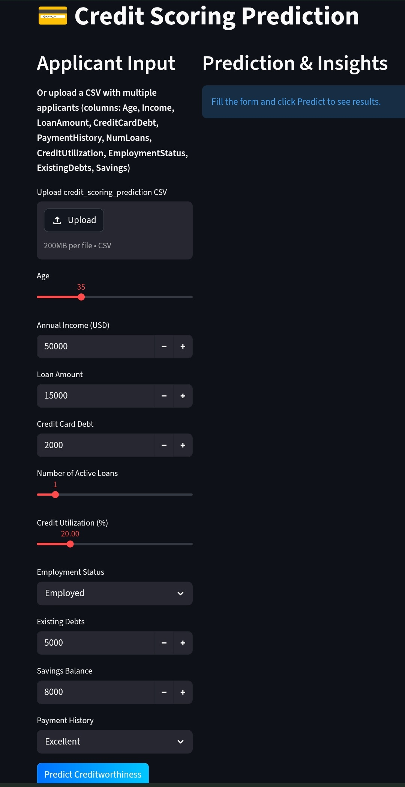
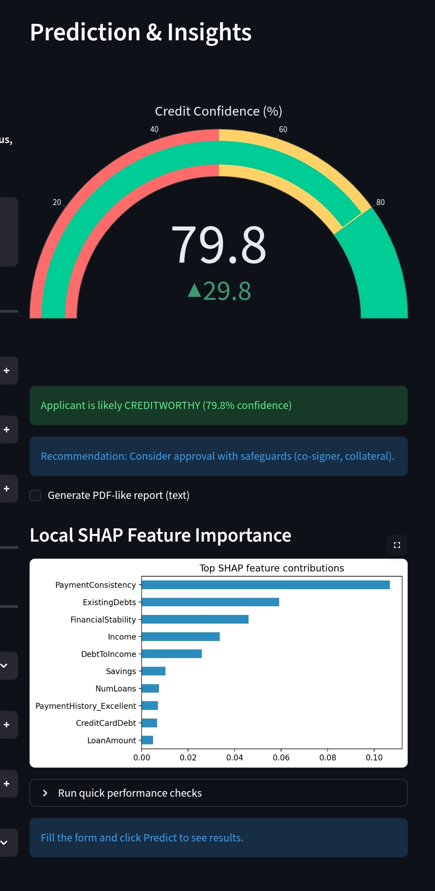

# 💳 AI-Powered Credit Scoring Prediction System

<div align="center">


### 🚀 Real-World AI Banking Risk Analysis System

🔗 **Live Demo:**  
👉 https://codealphacreditscoringmodel-fwkfl7jm9baogxefggksw2.streamlit.app/

</div>

---

# 📌 Project Overview

This project is an **AI-powered Credit Scoring Prediction System** developed as part of the **CodeAlpha Artificial Intelligence Internship**.

The application predicts whether a customer is:

✅ Creditworthy  
❌ High Risk  

using Machine Learning algorithms trained on financial history data.

The system includes:
- Data preprocessing
- Feature engineering
- Model training
- Model evaluation
- Real-world Streamlit web application
- Interactive prediction dashboard

---

# 🎯 CodeAlpha Internship Task

## ✅ TASK 1 — Credit Scoring Model

### Objective:
Predict an individual's creditworthiness using past financial and behavioral data.

### Implemented Features:
✔ Feature Engineering  
✔ Data Preprocessing  
✔ Machine Learning Classification  
✔ Streamlit Web Application  
✔ Model Evaluation Metrics  
✔ Real-Time Prediction System  

---

# 🧠 Machine Learning Algorithms Used

| Algorithm | Purpose |
|---|---|
| Logistic Regression | Baseline Classification |
| Decision Tree | Rule-Based Prediction |
| Random Forest | Final High Accuracy Model |

---

# 📊 Model Evaluation Metrics

✅ Accuracy  
✅ Precision  
✅ Recall  
✅ F1-Score  
✅ ROC-AUC Score  
✅ Confusion Matrix  

---

# ⚡ Features of the Web App

✨ Modern Banking UI  
✨ Real-Time Credit Prediction  
✨ Risk Analysis Dashboard  
✨ Interactive User Inputs  
✨ Financial Recommendation System  
✨ Responsive Design  
✨ Professional Streamlit Interface  

---

# 🖼️ Application Screenshots

## 🔹 Input Prediction Page

<p align="center">
  
</p>

---

## 🔹 Prediction Output Page

<p align="center">
  
</p>

---

# 🛠️ Technologies & Libraries Used

## 👨‍💻 Programming Language
- Python

## 📚 Libraries

```python
streamlit
pandas
numpy
scikit-learn
matplotlib
seaborn
joblib

CodeAlpha_Credit_Scoring_Model/
│
├── artifacts/
│   └── model.pkl
│
├── images/
│   ├── input_page.png
│   └── output_page.png
│
├── Credit_Scoring_Prediction_System.ipynb
├── app.py
├── train_and_save.py
├── requirements.txt
├── README.md
└── .gitignore
🚀 Installation & Setup
1️⃣ Clone Repository
git clone https://github.com/YOUR_GITHUB_USERNAME/CodeAlpha_Credit_Scoring_Model.git
2️⃣ Install Dependencies
pip install -r requirements.txt
3️⃣ Run Streamlit Application
streamlit run app.py
🌐 Live Application
🔗 Public Deployment Link

👉 https://codealphacreditscoringmodel-fwkfl7jm9baogxefggksw2.streamlit.app/

📈 Future Improvements

🚀 SHAP Explainable AI
🚀 Deep Learning Integration
🚀 Cloud Database Support
🚀 Loan Recommendation System
🚀 User Authentication System

🙌 Acknowledgement

Special thanks to:

💙 CodeAlpha
💙 Streamlit
💙 Open Source Community

for providing learning opportunities and resources.

👨‍💻 Developed By
✨ Kavin
Machine Learning Intern @ CodeAlpha
<div align="center">

⭐ If you like this project, give it a star on GitHub ⭐

 </div> ```
